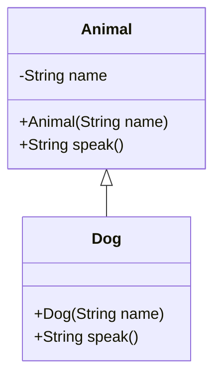
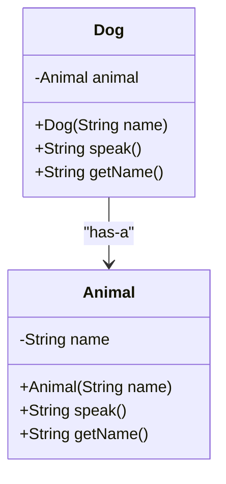

# クラスの代表的な拡張方法
- 継承のコード例: `src/Inheritance.java`
- 合成のコード例: `src/Composition.java`

## 継承 (Inheritance)
継承とは、あるクラスが別のクラスのプロパティやメソッドを引き継ぐ方法のこと。サブクラス（子クラス）がスーパークラス（親クラス）のすべての機能を利用できるため、親クラスの再利用に適している。

- 利点
    - **コードの再利用性**：親クラスの機能をそのまま再利用できる。
    - **拡張性**：子クラスに独自の機能（メソッドのオーバーライドなど）を追加して、特定の振る舞いを持たせることができる。
- 欠点
    - **親クラスへの依存**：親クラスの変更が子クラスに影響を与えるため、設計が密結合になりやすい。
    - **多重継承の複雑さ**：複数のクラスを継承する場合、競合するメソッドや属性の扱いが複雑になる。

## 合成 (Composition)
合成は、あるクラスが別のクラスのインスタンスを自身のプロパティとして持つ方法のこと。合成を使うと、あるクラスの一部として他のクラスの機能を利用でき、柔軟な設計が可能となる。

- 利点
    - **疎結合**：DogクラスはAnimalクラスの特定の機能のみを使用するため、依存関係が少なく、柔軟性が高い。
    - **再利用性**：別のクラスでもAnimalクラスをインスタンスとして持ち、異なる機能で利用可能。
- 欠点
    - **コードの冗長性**：合成の場合、親クラスの機能にアクセスするためにメソッドを追加で定義する必要がある場合がある。
    - **インスタンス管理の手間**：複数のオブジェクトを持つため、メモリ管理や状態管理が複雑になることがある。

## 継承と合成の使い分け
- 継承は、「is-a」関係（例：DogはAnimalである）に適しており、親クラスの拡張が必要な場合に向いている。
- 合成は、「has-a」関係（例：DogはAnimalを持っている）に適しており、柔軟で再利用性が高く、依存関係が少ない設計に向いている。
